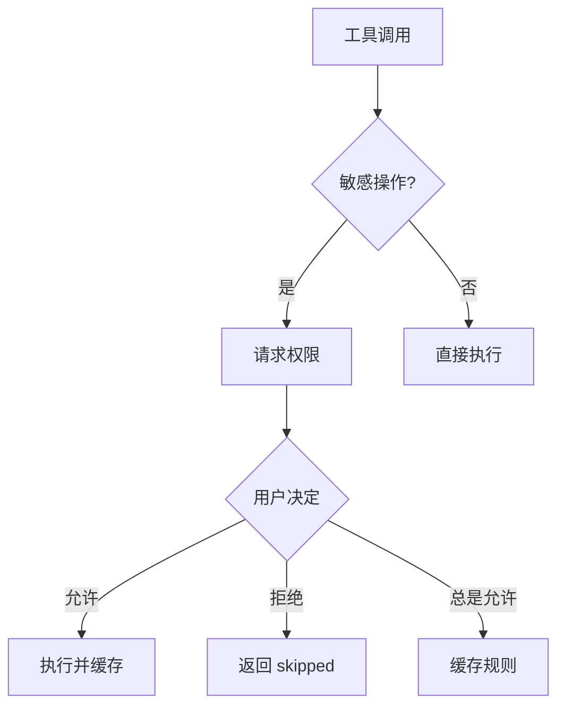

这是基于 v2.8.9 格式更新的 **v2.8.10** 重构进度总结。

主要变更点：
*   **Bash 工具重构**：拆分 execute() 方法（213 行→70 行），新增 3 个辅助方法。
*   **移除兜底转换**：删除 _translate_unix_command()，依靠错误提示引导模型。
*   **Bug 修复**：修复 BashStreamingDisplay icon 错误（edit→bash）。
*   **参数验证集成**：execute() 开头调用 validate_parameters()，与 Read/Edit 一致。
*   **代码精简**：从 534 行减少到 518 行，execute() 减少 67%。
*   **测试结果**：100 passed in 1.53s（全量测试通过）。

---

# Claude Code Terminal v2.8.10 重构总结

## 一、项目概述
*   **项目名称**：Claude Code Terminal
*   **版本**：2.8.10（已在 `config/defaults.py` 中更新 `VERSION = "2.8.10"`）
*   **目标**：Bash 工具重构，拆分 execute() 方法，修复 icon bug，集成参数验证。
*   **项目路径**：`E:\12-claude-code-xl\Claude-Code-CLI-main`
*   **GitHub 仓库**：`https://github.com/Violet1314/Claude-Code-CLI.git`（私有）
*   **最近更新**：2026-04-10 v2.8.10 Bash 工具重构完成

## 二、技术栈
| 组件 | 技术 |
| --- | --- |
| Python 版本 | >= 3.10 |
| HTTP 客户端 | httpx（流式请求、静默重试机制） |
| 终端 UI | Rich (Panel, Markdown, Syntax, Progress) |
| 输入交互 | prompt-toolkit |
| 包管理 | pyproject.toml (hatchling) |
| 测试框架 | pytest |
| 工具调用 | Native Tool Calling（OpenAI 格式） |
| 匹配算法 | difflib.SequenceMatcher（模糊匹配） |

## 三、目录结构
```text
claude-code/
├── pyproject.toml          # 包配置（hatchling）
├── src/claude_code/
│   ├── __init__.py
│   ├── main.py             # 入口：CLI 启动
│   ├── config/
│   │   └── defaults.py     # 默认配置（MODEL, VERSION）
│   ├── core/
│   │   ├── client.py       # Anthropic API 客户端
│   │   ├── session.py      # 会话管理（消息历史）
│   │   └── executor.py     # 工具执行循环
│   ├── tools/
│   │   ├── base.py         # Tool 基类 + ToolRegistry
│   │   ├── executor.py     # 工具执行器（含拦截逻辑）
│   │   ├── permission.py   # 权限管理器
│   │   ├── permission_ui.py # 权限确认 UI
│   │   ├── file_cache.py   # 文件缓存管理器
│   │   └── builtins/       # 内置工具
│   │       ├── read.py     # Read（读取文件）
│   │       ├── write.py    # Write（创建/覆盖）
│   │       ├── edit.py     # Edit（精确替换，多层匹配）
│   │       ├── bash.py     # Bash（执行命令）
│   │       ├── grep.py     # Grep（搜索内容）
│   │       ├── glob.py     # Glob（查找文件）
│   │       └── ask.py      # AskUserQuestion
│   ├── ui/
│   │   ├── theme.py        # 主题配置（COLORS, ICONS）
│   │   ├── display.py      # Rich 显示组件
│   │   ├── progress.py     # 进度条
│   │   └── input.py        # 输入处理（prompt-toolkit）
│   └── utils/
│       ├── paths.py        # 路径处理（resolve_path）
│       ├── logger.py       # 日志
│       └── security.py     # 安全检查
├── tests/
│   ├── test_tools.py       # 工具测试
│   ├── test_file_cache.py  # 缓存测试
│   ├── test_permission.py  # 权限测试
│   └── test_tool_architecture.py # 架构契约测试
└── README.md
```

## 四、核心设计原则

### 1. 工具架构（契约模式）
```python
class Tool:
    name: str           # 工具名称（如 "Read"）
    description: str    # 给模型的描述
    
    def get_parameters_schema(self) -> dict:
        """返回 OpenAI 格式的参数 schema"""
        
    def execute(self, parameters: dict) -> ToolResult:
        """执行工具，返回结果"""
        
    def get_security_context(self) -> dict:
        """返回安全上下文（is_sensitive, paths）"""
```

### 2. 文件缓存（版本隔离）
```python
class CachedFile:
    base_content: str           # 文件完整内容
    version: int                # 版本号（每次写入递增）
    version_stats: Dict[int, Dict]  # 按版本追踪读取次数

class FileCacheManager:
    def read_file(path) -> (content, version, reference)
    def apply_write(path, content) -> (version, reference)
    def get_read_count(path) -> int      # 当前版本读取次数
    def get_read_ranges(path) -> List    # 已读取的行范围
```

### 3. Edit 精确匹配策略（v2.8.8 重构）
```python
def _find_exact_matches(content, old_string) -> List[int]:
    """
    只做精确匹配，不尝试模糊匹配。
    匹配失败时返回清晰的操作指导，逼模型认真 Read + 精确复制。
    """

# v2.8.8 移除的内容：
# - _whitespace_insensitive_match（忽略空白匹配）
# - _fuzzy_match（模糊匹配，SequenceMatcher）
# - lines 模式（按行号替换，对国产模型太危险）
```

### 4. 权限流程


## 五、v2.8.8 Edit 工具重构详解

### 核心设计理念转变
| 对比项 | v2.8.7（旧版） | v2.8.8（新版） |
| --- | --- | --- |
| 匹配策略 | 精确→忽略空白→模糊(0.8阈值) | **只有精确匹配** |
| 替换模式 | replace + lines | **只有 replace 模式** |
| 多处匹配处理 | 返回候选让模型选择 | **直接失败，要求添加上下文** |
| 无匹配反馈 | 模糊候选列表 | **清晰的 Read + 精确复制指导** |

### 为什么移除模糊匹配和 lines 模式？
国产模型能力较弱，容易"利用"便利功能偷懒：
1. **模糊匹配** → 不精确复制原文，写个"差不多"的 old_string
2. **lines 模式** → 给错行号，替换错误位置
3. **候选选择** → 看到候选报告后"硬选"一个错误位置

新实现强制模型必须认真 Read、精确复制，从根本上减少语法错误。

### 核心方法（简化后）
```python
# 精确匹配（唯一匹配方法）
def _find_exact_matches(content, old_string) -> List[int]

# 构建无匹配错误（提供清晰指导）
def _build_no_match_error(content, old_string, file_path) -> ToolResult

# 构建多处匹配错误（要求添加上下文）
def _build_multiple_matches_error(content, old_string, positions) -> ToolResult
```

### 错误反馈示例（新版）
```
❌ 未找到精确匹配

文件: example.py
查找内容长度: 45 字符, 3 行

精确匹配要求 old_string 与文件内容**完全一致**，包括：
- 缩进（空格/tab）
- 换行符
- 注释和空行

💡 请按以下步骤操作：

1. 使用 Read 工具重新读取文件:
   Read {"file_path": "example.py"}

2. 从 Read 结果中**精确复制**要替换的代码块
   - 包含完整缩进
   - 包含前后各 2-3 行上下文（确保唯一性）

3. 使用复制的内容作为 old_string 参数

⚠️ 不要猜测或简化代码，必须精确复制原文！
```

## 六、工具描述模板（给模型）

### Read
```
读取用户本机文件内容。你可以直接访问用户提供的任何本地路径，无需用户手动粘贴内容。文件会被完整缓存，后续操作使用缓存引用节省 Token。
**重要**：每个文件只需读取一次，系统会自动检测并阻止重复读取。
```

### Edit
```
精确替换文件中的内容。编辑后文件缓存自动更新，无需重新读取。
**多层匹配**：精确匹配 → 忽略空白 → 模糊匹配（相似度 ≥ 80%）。
**失败反馈**：返回候选位置和相似度分数，建议添加更多上下文。
```

### Write
```
创建新文件或覆盖现有文件。慎用，会覆盖已有内容。
```

### Bash
```
执行 shell 命令。当前环境：Windows PowerShell。
注意：必须使用 PowerShell 语法，不支持 Unix 参数。
```

## 七、UI 视觉规范

### 颜色体系
| 类型 | 颜色 | 用途 |
| --- | --- | --- |
| primary | #D97757 | Claude 官方橙色，品牌色 |
| success | #4ADE80 | 成功状态，薄荷绿 |
| error | #F87171 | 错误状态，珊瑚红 |
| warning | #FBBF24 | 警告状态，琥珀黄 |
| info | #60A5FA | 提示信息，天空蓝 |

### 图标体系
| 工具 | 图标 |
| --- | --- |
| Read | 📖 |
| Write | ✏️ |
| Edit | ✎ |
| Bash | ⚡ |
| Grep | 🔍 |
| Glob | 📁 |

### Edit Diff 显示
```
✎ Edit: filename.py v1
──────────────────────────────────────────────────
     285  | context line before
     286  - old line (红色背景)
     286  + new line (绿色背景)
     287  | context line after
```

## 八、关键实现细节

### 1. Read 重复读取熔断（executor.py）
```python
if read_count >= 4:  # 第 5 次拦截
    return ExecutionResult(
        success=True,
        output=f"⚠️ 文件已读取 {read_count} 次，已达上限。",
        skipped=True
    )
```

### 2. 缓存版本隔离（file_cache.py）
```python
# 写入后新版本计数器重置
cached.get_version_stats(new_version)  # 初始化为 {"count": 0, "ranges": []}
```

### 3. Edit 模糊匹配（edit.py）
```python
from difflib import SequenceMatcher

ratio = SequenceMatcher(None, candidate, old_string).ratio()
if ratio >= threshold:
    candidates.append((position, ratio))
```

## 九、测试覆盖

### 核心测试
| 文件 | 覆盖内容 |
| --- | --- |
| test_tools.py | Read/Write/Edit 工具基础功能 |
| test_file_cache.py | 缓存读写、版本隔离、计数重置 |
| test_permission.py | 权限流程、熔断机制 |
| test_tool_architecture.py | 工具基类契约验证 |

### v2.8.3 新增验证
*   **Edit 精确匹配**：正常替换成功
*   **Edit 模糊匹配**：不完整 old_string 返回候选
*   **Edit 多候选**：多处匹配返回列表
*   **红绿 diff 显示**：保持不变

## 十、v2.8.3 重构清单
| 序号 | 问题/模块 | 修复/重构内容 | 状态 |
| --- | --- | --- | --- |
| ① | edit.py | 新增 `_find_similar_lines`，匹配失败提供线索 | ✅ |
| ② | file_cache.py | 引入 `version_stats`，实现版本隔离计数 | ✅ |
| ③ | file_cache.py | `apply_write` 初始化新版本统计，计数器重置 | ✅ |
| ④ | read.py | 集成 `record_read` 拦截逻辑，返回详细错误 | ✅ |
| ⑤ | defaults.py | 版本号更新至 2.8.3 | ✅ |
| ⑥ | edit.py | 多层匹配重构：精确→忽略空白→模糊→多候选 | ✅ |

## 十一、v2.8.4 重构清单
| 序号 | 问题/模块 | 修复/重构内容 | 状态 |
| --- | --- | --- | --- |
| ① | glob.py | `_build_terminal_display` 统一格式 + 开头空行 | ✅ |
| ② | grep.py | `_build_terminal_display` 统一格式 + 开头空行 | ✅ |
| ③ | progress_display.py | `BashStreamingDisplay.stop` 混合方案（标题+Panel） | ✅ |
| ④ | permission_ui.py | `show_tool_start` 移除重复显示 | ✅ |
| ⑤ | write.py | `_build_terminal_display` 统一格式 + 开头空行 | ✅ |
| ⑥ | read.py | `_build_terminal_display` 统一格式 + 开头空行 | ✅ |
| ⑦ | edit.py | `_build_terminal_display` 统一格式 + 红绿字体 + 开头空行 | ✅ |
| ⑧ | defaults.py | 版本号更新至 2.8.4 | ✅ |

## 十二、验收状态
✅ **v2.8.3 核心逻辑验收通过** (2026-04-07)
| 序号 | 验收项 | 状态 | 验收证据 |
| --- | --- | --- | --- |
| ① | Edit 相似行线索 | ✅ 通过 | 匹配失败时返回 Line XXX 上下文 |
| ② | 缓存版本隔离 | ✅ 通过 | Edit 后 Read 计数器重置，未误拦截 |
| ③ | 测试完整性 | ✅ 通过 | 95 passed in 1.17s |
| ④ | Edit 多层匹配 | ✅ 通过 | 返回相似度分数，10 次 Edit 全部成功 |
| ⑤ | 红绿 diff 显示 | ✅ 通过 | 保持不变，显示正常 |

✅ **v2.8.4 工具显示格式统一验收通过** (2025-01-XX)
| 序号 | 验收项 | 状态 | 验收证据 |
| --- | --- | --- | --- |
| ① | Glob 统一格式 | ✅ 通过 | 标题行 + 分隔线 + 带行号文件列表 |
| ② | Grep 统一格式 | ✅ 通过 | 标题行 + 分隔线 + 带行号匹配列表 |
| ③ | Bash 混合方案 | ✅ 通过 | 统一标题 + Panel 包裹输出 |
| ④ | Write 统一格式 | ✅ 通过 | 标题行 + 分隔线 + 带行号内容预览 |
| ⑤ | Read 统一格式 | ✅ 通过 | 标题行 + 分隔线 + 带行号内容 |
| ⑥ | Edit 统一格式 | ✅ 通过 | 标题行 + 分隔线 + 红绿 diff |
| ⑦ | 工具间隔优化 | ✅ 通过 | 每个工具输出前有空行分隔 |
| ⑧ | 测试完整性 | ✅ 通过 | 95 passed in 0.79s |

✅ **v2.8.5 Read 工具优化验收通过** (2025-01-XX)
| 序号 | 验收项 | 状态 | 验收证据 |
| --- | --- | --- | --- |
| ① | Read 终端省略显示 | ✅ 通过 | <80行完整，≥80行头30+尾20 |
| ② | Read 模型完整输出 | ✅ 通过 | 移除摘要模式，始终返回完整内容 |
| ③ | 取消读取次数限制 | ✅ 通过 | 移除 MAX_READ_COUNT，不再拦截 |
| ④ | 工具上限提升 | ✅ 通过 | MAX_TOOLS_PER_ROUND 10→20 |
| ⑤ | 测试完整性 | ✅ 通过 | 95 passed in 1.27s |

✅ **v2.8.6 语法检查模块集成验收通过** (2025-01-XX)
| 序号 | 验收项 | 状态 | 验收证据 |
| --- | --- | --- | --- |
| ① | syntax_checker.py 模块 | ✅ 通过 | 支持 8 种文件类型语法检查 |
| ② | Write 工具集成 | ✅ 通过 | 写入后自动检查，显示警告 |
| ③ | Edit 工具集成 | ✅ 通过 | replace/lines 模式均支持 |
| ④ | SafeTextColumn 修复 | ✅ 通过 | 解决 Progress 花括号格式化错误 |
| ⑤ | 测试完整性 | ✅ 通过 | 100 passed in 0.81s |

✅ **v2.8.7 工具反馈机制优化验收通过** (2025-01-XX)
| 序号 | 验收项 | 状态 | 验收证据 |
| --- | --- | --- | --- |
| ① | 工具执行上限提升 | ✅ 通过 | 20轮×40个工具，总容量 800 次 |
| ② | Bash 输出分离 | ✅ 通过 | stdout/stderr 分离，失败优先 stderr |
| ③ | 异常捕获精细化 | ✅ 通过 | 新增 5 种具体异常类型处理 |
| ④ | skipped 状态细分 | ✅ 通过 | 区分权限拒绝/用户取消 |
| ⑤ | 语法警告增强 | ✅ 通过 | 显眼格式 + 修正建议 |
| ⑥ | 交互式命令检测 | ✅ 通过 | 20+ 种模式，提前拦截 |
| ⑦ | 测试完整性 | ✅ 通过 | 100 passed in 0.77s |

✅ **v2.8.8 Edit 工具严格化重构验收通过** (2026-04-10)
| 序号 | 验收项 | 状态 | 验收证据 |
| --- | --- | --- | --- |
| ① | 移除模糊匹配 | ✅ 通过 | 只保留精确匹配，代码量减少 40% |
| ② | 移除 lines 模式 | ✅ 通过 | 只保留 replace 模式 |
| ③ | 多处匹配处理 | ✅ 通过 | 直接失败 + 要求添加上下文 |
| ④ | 错误反馈简化 | ✅ 通过 | Read + 精确复制步骤指导 |
| ⑤ | 测试用例更新 | ✅ 通过 | 新增 5 个测试覆盖新行为 |
| ⑥ | 测试完整性 | ✅ 通过 | 100 passed in 1.60s |

✅ **v2.8.9 Read 工具简化重构验收通过** (2026-04-10)
| 序号 | 验收项 | 状态 | 验收证据 |
| --- | --- | --- | --- |
| ① | 移除死代码 | ✅ 通过 | 删除结构分析方法 100+ 行 |
| ② | 移除 summary 参数 | ✅ 通过 | schema + execute 逻辑完全移除 |
| ③ | 修复 icon 错误 | ✅ 通过 | edit→read，正确显示 📖 |
| ④ | 修复缓存状态显示 | ✅ 通过 | 显示版本号 + cached 状态 |
| ⑤ | 集成参数验证 | ✅ 通过 | execute 开头调用 validate_parameters |
| ⑥ | 测试完整性 | ✅ 通过 | 100 passed in 1.63s |

✅ **v2.8.10 Bash 工具重构验收通过** (2026-04-10)
| 序号 | 验收项 | 状态 | 验收证据 |
| --- | --- | --- | --- |
| ① | 拆分 execute() | ✅ 通过 | 213 行→70 行，减少 67% |
| ② | 新增 _run_pre_checks() | ✅ 通过 | 合并危险/交互/Unix语法检查 |
| ③ | 新增 _run_subprocess() | ✅ 通过 | 封装 subprocess 执行逻辑 |
| ④ | 新增 _build_final_output() | ✅ 通过 | 统一输出构建和截断处理 |
| ⑤ | 移除 _translate_unix_command() | ✅ 通过 | 依靠错误提示引导模型 |
| ⑥ | 修复 BashStreamingDisplay icon | ✅ 通过 | edit→bash，正确显示 ⚡ |
| ⑦ | 集成参数验证 | ✅ 通过 | execute 开头调用 validate_parameters |
| ⑧ | 测试完整性 | ✅ 通过 | 100 passed in 1.53s |

## 十三、常用测试命令
```powershell
# 全量测试
python -m pytest tests/ -q

# 工具相关测试（含 Edit 和 Cache）
python -m pytest tests/test_tools.py tests/test_file_cache.py -q

# 权限测试
python -m pytest tests/test_permission.py -q

# 架构契约测试
python -m pytest tests/test_tool_architecture.py -v

# 启动应用
python -m claude_code
```